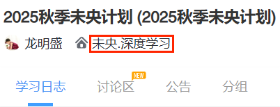

# 安装

<details>
<summary><code>Android</code></summary>

## 安装 Termux

Termux 是一个面向 Android 的开源终端仿真器和 Linux 环境应用。它通过应用包管理系统提供了一系列 Unix 软件包，可以直接在 Android 设备上运行，详细介绍及安装方法移步[官网](https://termux.dev/cn/index.html)，使用需要一定 Linux 基础

## 使用 Termux

启动 Termux，进入命令行界面，为获取系统文件权限，输入
```shell
termux-setup-storage
```
为查看当前目录，输入
```shell
pwd
```
每次启动当前目录默认为 `/data/data/com.termux/files/home/`，未获取 root 权限时文件管理器无法访问该目录。如未 root，之后在此目录下运行程序请提前修改 `config.json`（熟悉程序后推荐使用，具体见后续 **运行** 及 **说明** ），否则应使用`cp`工具将文件从 `/data/data/com.termux/files/home/` 传输到 `/storage/emulated/0/`（手机内部存储**根目录**，可用文件管理器直接访问）

也可切换当前目录到内部存储，即输入
```shell
cd /storage/emulated/0
```
此时可直接在文件管理器中查看并修改文件，推荐小白使用

## 安装项目及依赖
```shell
pkg update
pkg upgrade -y
pkg install -y python git libjpeg-turbo python-pillow zbar
git clone https://github.com/thuhollow2/Hetangyuketang.git # 如需提前修改文件，可先自行fork
cd Hetangyuketang
pip install -r requirements.txt
```

</details>

<details>
<summary><code>iOS</code></summary>

## 安装 iSH Shell

iSH Shell 是一款运行在 iOS 系统上的 App，可以运行 Linux Shell，底层操作系统基于 Alpine Linux。它提供标准的 Linux 命令行接口，使用 apk 包管理器安装和管理软件包，无需越狱，可从 [App Store](https://apps.apple.com/app/ish-shell/id1436902243) 下载，使用需要一定 Linux 基础

## 使用 iSH Shell

启动 iSH，进入命令行界面，输入
```shell
pwd
```
查看当前目录，每次启动当前目录默认为 `/root` ，可在 **文件** > **浏览** > **iSH** > **root 文件夹** 访问，之后运行程序可在此查看或修改文件

## 安装项目及依赖
```shell
apk update
apk upgrade
apk add python3 py3-pip git py3-pillow zbar
ln -sf /usr/bin/python3 /usr/bin/python
git clone https://github.com/thuhollow2/Hetangyuketang.git # 如需提前修改文件，可先自行fork
cd Hetangyuketang
pip install -r requirements.txt
```

</details>

<details>
<summary><code>Other</code></summary>

下载本项目后，切换到项目根目录，执行以下命令安装依赖

```shell
pip install -r requirements.txt 
```
 - `pyzbar` 是对 **ZBar** 的 Python 封装，本身需要系统里有 **libzbar** 动态库；非 Windows 上必须先装 zbar 才能用，详情见 [pyzbar 安装说明](https://github.com/NaturalHistoryMuseum/pyzbar#installation)

</details>

---
# 运行

在项目根目录下，执行

```shell
python main.py
```

## 配置文件
<details>
<summary><code>config.json</code></summary>

```json
{
    "yuketang": {
        "domain": "pro.yuketang.cn",
        "classroomCodeList": ["JZOJ5C", "G84UAB"],
        "classroomWhiteList": [],
        "classroomBlackList": ["未央.机器学习", "未央.深度学习"],
        "classroomStartTimeDict": {
            "未央.机器学习": {"1": "08:00", "2": "13:30"},
            "未央.深度学习": {"1": "13:30"}
        },
        "llm": false,
        "an": false,
        "ppt": false,
        "si": false,
        "timeout": 30
    },
    "send": {
        "services": [
            {
                "name": "wechat",
                "enabled": false,
                "type": "wechat",
                "touser": "@all",
                "agentId": "####",
                "secret": "####",
                "companyId": "####",
                "msgLimit": 500,
                "dataLimit": 20971520
            },
            {
                "name": "dingtalk",
                "enabled": false,
                "type": "dingtalk",
                "appKey": "####",
                "appSecret": "####",
                "robotCode": "####",
                "openConversationId": "####",
                "msgLimit": 3000,
                "dataLimit": 20971520
            },
            {
                "name": "feishu",
                "enabled": false,
                "type": "feishu",
                "appId": "####",
                "appSecret": "####",
                "openId": "####",
                "msgLimit": 10000,
                "dataLimit": 31457280
            }
        ],
        "threads": 5,
        "timeout": 30
    },
    "llm": {
        "models": [
            {
                "name": "openai-o4-mini",
                "enabled": false,
                "type": "openai",
                "apiKey": "####",
                "model": "o4-mini",
                "prompt": "You are a helpful assistant.",
                "score": 100
            },
            {
                "name": "claude-3-5",
                "enabled": false,
                "type": "claude",
                "apiKey": "####",
                "model": "claude-3-5",
                "prompt": "You are a helpful assistant.",
                "temperature": 0.2,
                "score": 100
            },
            {
                "name": "grok-4-0709",
                "enabled": false,
                "type": "grok",
                "apiKey": "####",
                "model": "grok-4-0709",
                "prompt": "You are a helpful assistant.",
                "temperature": 0.2,
                "score": 100
            },
            {
                "name": "gemini-2.5-flash",
                "enabled": false,
                "type": "gemini",
                "apiKey": "####",
                "model": "gemini-2.5-flash",
                "prompt": "You are a helpful assistant.",
                "temperature": 0.2,
                "score": 100
            },
            {
                "name": "cloudflare-llama-4-scout-17b",
                "enabled": false,
                "type": "cloudflare",
                "accountId": "####",
                "apiToken": "####",
                "model": "@cf/meta/llama-4-scout-17b-16e-instruct",
                "prompt": "You are a helpful assistant.",
                "temperature": 0.2,
                "score": 100
            },
            {
                "name": "openrouter-gpt-oss-20b",
                "enabled": false,
                "type": "openrouter",
                "apiKey": "####",
                "model": "openai/gpt-oss-20b:free",
                "prompt": "You are a helpful assistant.",
                "temperature": 0.2,
                "score": 100
            },
            {
                "name": "poixe-gemini-2.5-flash",
                "enabled": false,
                "type": "poixe",
                "apiKey": "####",
                "model": "gemini-2.5-flash:free",
                "prompt": "You are a helpful assistant.",
                "temperature": 0.2,
                "score": 100
            },
            {
                "name": "siliconflow-glm-4.1v-9b-thinking",
                "enabled": false,
                "type": "siliconflow",
                "apiKey": "####",
                "model": "THUDM/GLM-4.1V-9B-Thinking",
                "prompt": "You are a helpful assistant.",
                "temperature": 0.2,
                "score": 100
            },
            {
                "name": "infinigence-glm-4.5v",
                "enabled": false,
                "type": "infinigence",
                "apiKey": "####",
                "model": "glm-4.5v",
                "prompt": "You are a helpful assistant.",
                "temperature": 0.2,
                "score": 100
            },
            {
                "name": "zhipu-glm-4.1v-thinking-flash",
                "enabled": false,
                "type": "zhipu",
                "apiKey": "####",
                "model": "GLM-4.1V-Thinking-Flash",
                "prompt": "You are a helpful assistant.",
                "temperature": 0.2,
                "score": 100
            },
            {
                "name": "dmxapi-glm-4.1v-9b-thinking",
                "enabled": false,
                "type": "dmxapi",
                "apiKey": "####",
                "model": "GLM-4.1V-9B-Thinking",
                "prompt": "You are a helpful assistant.",
                "temperature": 0.2,
                "score": 100
            },
            {
                "name": "modelscope-intern-s1",
                "enabled": false,
                "type": "modelscope",
                "accessToken": "####",
                "model": "Shanghai_AI_Laboratory/Intern-S1",
                "prompt": "You are a helpful assistant.",
                "temperature": 0.2,
                "score": 100
            },
            {
                "name": "moonshot-kimi-latest",
                "enabled": false,
                "type": "moonshot",
                "apiKey": "####",
                "model": "kimi-latest",
                "prompt": "You are a helpful assistant.",
                "temperature": 0.2,
                "score": 100
            },
            {
                "name": "volcengine-doubao-seed-1-6-vision",
                "enabled": false,
                "type": "volcengine",
                "apiKey": "####",
                "model": "doubao-seed-1-6-vision-250815",
                "prompt": "You are a helpful assistant.",
                "temperature": 0.2,
                "score": 100
            },
            {
                "name": "poloapi-gemini-2.5-flash",
                "enabled": false,
                "type": "poloapi",
                "apiKey": "####",
                "model": "gemini-2.5-flash",
                "prompt": "You are a helpful assistant.",
                "temperature": 0.2,
                "score": 100
            },
            {
                "name": "bailian-qwen3-vl-plus",
                "enabled": false,
                "type": "bailian",
                "apiKey": "####",
                "model": "qwen3-vl-plus",
                "prompt": "You are a helpful assistant.",
                "temperature": 0.2,
                "score": 100
            },
            {
                "name": "qianfan-ernie-4.5-turbo-vl-latest",
                "enabled": false,
                "type": "qianfan",
                "apiKey": "####",
                "model": "ernie-4.5-turbo-vl-latest",
                "prompt": "You are a helpful assistant.",
                "temperature": 0.2,
                "score": 100
            },
            {
                "name": "xunfei-xqwen2d5s32bvl",
                "enabled": false,
                "type": "xunfei",
                "apiKey": "####",
                "model": "xqwen2d5s32bvl",
                "prompt": "You are a helpful assistant.",
                "temperature": 0.2,
                "score": 100
            },
            {
                "name": "minimax-MiniMax-Text-01",
                "enabled": false,
                "type": "minimax",
                "apiKey": "####",
                "model": "MiniMax-Text-01",
                "prompt": "You are a helpful assistant.",
                "temperature": 0.2,
                "score": 100
            },
            {
                "name": "lingyiwanwu-yi-vision-v2",
                "enabled": false,
                "type": "lingyiwanwu",
                "apiKey": "####",
                "model": "yi-vision-v2",
                "prompt": "You are a helpful assistant.",
                "temperature": 0.2,
                "score": 100
            },
            {
                "name": "sensecore-SenseNova-V6-Pro",
                "enabled": false,
                "type": "sensecore",
                "accessKeyId": "####",
                "accessKeySecret": "####",
                "model": "SenseNova-V6-Pro",
                "prompt": "You are a helpful assistant.",
                "temperature": 0.2,
                "score": 100
            },
            {
                "name": "mistral-mistral-small-latest",
                "enabled": false,
                "type": "mistral",
                "apiKey": "####",
                "model": "mistral-small-latest",
                "prompt": "You are a helpful assistant.",
                "temperature": 0.2,
                "score": 100
            },
            {
                "name": "hunyuan-hunyuan-t1-vision",
                "enabled": false,
                "type": "hunyuan",
                "apiKey": "####",
                "model": "hunyuan-t1-vision",
                "prompt": "You are a helpful assistant.",
                "temperature": 0.2,
                "score": 100
            },
            {
                "name": "meta-Llama-4-Maverick-17B-128E-Instruct-FP8",
                "enabled": false,
                "type": "meta",
                "apiKey": "####",
                "model": "Llama-4-Maverick-17B-128E-Instruct-FP8",
                "prompt": "You are a helpful assistant.",
                "temperature": 0.2,
                "score": 100
            },
            {
                "name": "cohere-command-a-vision-07-2025",
                "enabled": false,
                "type": "cohere",
                "apiKey": "####",
                "model": "command-a-vision-07-2025",
                "prompt": "You are a helpful assistant.",
                "temperature": 0.2,
                "score": 100
            }
        ],
        "threads": 5,
        "timeout": 300
    },
    "util": {
        "timezone": "Asia/Shanghai",
        "threads": 20,
        "timeout": 30
    }
}
```

</details>

---
# 说明

 - 首次运行将下载、发送并在终端展示雨课堂登录二维码，微信扫码获取 cookie，有效期约两周；有效期少于两天时，每小时初将发送二维码提醒，请及时扫码更新，谨防失效后消息轰炸

 - 支持多线程监听，每 30 秒扫描新课堂、尝试使用班级邀请码/课堂暗号加入新班级，随后自动签到、下载课件（PDF）、打印题目、生成并打印答案、获取 PPT 进度、自动答题等

 - 签到方式为通过“正在上课”提示进入课堂

 - 答案已无法从雨课堂前端获取，现改用大语言模型生成

 - 自动答题支持单选题、多选题、投票题、填空题和主观题；若未获取到答案，将提交默认答案（可修改[此处](yuketang.py#L380-L391)）

 - 课程名可在雨课堂首页的课程标签里查找，具体如图中红框所示

 
 
 

## 配置文件

### yuketang

<details>
<summary><code>domain</code></summary>

雨课堂域名
| 网站 | 域名 |
| -------- | -------- |
| 雨课堂 | [www.yuketang.cn](https://www.yuketang.cn) |
| 荷塘雨课堂 | [pro.yuketang.cn](https://pro.yuketang.cn) |
| 长江雨课堂 | [changjiang.yuketang.cn](https://changjiang.yuketang.cn) |
| 黄河雨课堂 | [huanghe.yuketang.cn](https://huanghe.yuketang.cn) |

</details>

<details>
<summary><code>classroomCodeList</code></summary>

班级邀请码/课堂暗号列表。每 30 秒尝试加入相应班级，班级满员时可启用此功能待成员退出抢占名额

</details>

<details>
<summary><code>classroomWhiteList</code></summary>

课程白名单。记录课程名，优先级低于黑名单，课程名采用完全匹配，为空时不启用

</details>

<details>
<summary><code>classroomBlackList</code></summary>

课程黑名单。记录课程名，优先级高于白名单，课程名采用完全匹配，为空时不启用

</details>

<details>
<summary><code>classroomStartTimeDict</code></summary>

课程星期内各日最早进入时间。课程名采用完全匹配；使用指定时区，周一-周日对应 `1 - 7`，时间格式为 `HH:MM`；当日时间值不为空且此时早于该值不签到，数字或时间为空不启用

</details>

<details>
<summary><code>llm</code></summary>

是否使用大语言模型生成答案

</details>

<details>
<summary><code>an</code></summary>

是否自动答题

</details>

<details>
<summary><code>ppt</code></summary>

是否发送 PPT 文件

</details>

<details>
<summary><code>si</code></summary>

是否实时推送 PPT 进度

</details>

<details>
<summary><code>timeout</code></summary>

连接雨课堂的超时秒数

</details>

### send

<details>
<summary><code>services</code></summary>

推送方式配置，目前支持企业微信、钉钉、飞书

#### 通用字段
| 字段 | 说明 |
| --- | --- |
| name | 服务名称（自定义，用于通行密钥标识） |
| enabled | 是否启用 |
| type | 服务类型（wechat/dingtalk/feishu） |
| msgLimit | 单次文本长度限制（字符） |
| dataLimit | 单次文件大小限制（字节） |

#### 服务凭证

 - 企业微信：[注册企业微信](https://work.weixin.qq.com/wework_admin/register_wx?from=myhome)、[创建应用](https://work.weixin.qq.com/wework_admin/frame#apps/createApiApp)、[**配置企业可信 IP**](https://work.weixin.qq.com/wework_admin/frame#apps)，填充 `touser`、`agentId`、`secret`、`companyId`

 - 钉钉：[注册钉钉开发者账号](https://open-dev.dingtalk.com/)、[创建并发布企业内部应用（应用内创建机器人）](https://open-dev.dingtalk.com/fe/app#/corp/app)、创建群会话、[获取群会话 openConversationId](https://open.dingtalk.com/tools/explorer/jsapi?id=10303)、机器人添加进群，填充 `appKey`、`appSecret`、`robotCode`、`openConversationId`

 - 飞书：[注册飞书开发者账号、创建并发布企业内部应用](https://open.feishu.cn/app?lang=zh-CN)、[开启机器人能力](https://open.feishu.cn/document/faq/trouble-shooting/how-to-enable-bot-ability)、[获取 OpenId](https://open.feishu.cn/document/server-docs/im-v1/message/create)、开通权限（[*以应用的身份发消息*](https://open.feishu.cn/document/server-docs/im-v1/message/create)，[*获取与上传图片或文件资源*](https://open.feishu.cn/document/server-docs/im-v1/file/create)），填充 `appId`、`appSecret`、`openId`

#### 分块限制

单次推送有大小限制，超过将分块传输，可设置
| 推送方式 | 消息限制 (`msgLimit`) | 文件限制 (`dataLimit`) | 
| -------- | -------- | -------- |
| 企业微信 (`wx`) | 500字符 (500) | 20MB (20971520) |
| 钉钉 (`dd`) | 3000字符 (3000) | 20MB (20971520) |
| 飞书 (`fs`) | 10000字符 (10000) | 30MB (31457280) |

</details>

<details>
<summary><code>threads</code></summary>

并行服务的最大线程数

</details>

<details>
<summary><code>timeout</code></summary>

连接服务的超时秒数

</details>

### llm

<details>
<summary><code>models</code></summary>

大语言模型配置，目前支持 [OpenAI](https://platform.openai.com/docs/models)、[Claude](https://docs.claude.com/en/docs/about-claude/models/overview)、[Grok](https://docs.x.ai/docs/models)、[Gemini](https://ai.google.dev/gemini-api/docs/models)、[Cloudflare](https://developers.cloudflare.com/workers-ai/models/)、[OpenRouter](https://openrouter.ai/models)、[Poixe](https://poixe.com/model)、[硅基流动](https://cloud.siliconflow.cn/me/models)、[无问芯穹](https://cloud.infini-ai.com/genstudio/model)、[智谱](https://bigmodel.cn/console/modelcenter/square)、[DMXAPI](https://www.dmxapi.com/pricing)、[魔塔社区](https://modelscope.cn/models)、[月之暗面](https://platform.moonshot.cn/docs/pricing/chat)、[火山方舟](https://console.volcengine.com/ark/region:ark+cn-beijing/model)、[PoloAPI](https://poloapi.com/models)、[阿里云百炼](https://bailian.console.aliyun.com/?tab=model#/model-market)、[百度千帆](https://console.bce.baidu.com/qianfan/modelcenter/model/buildIn/list)、[讯飞星辰](https://maas.xfyun.cn/modelSquare)、[MiniMax](https://www.minimaxi.com/price)、[零一万物](https://platform.lingyiwanwu.com/)、[商汤大装置](https://console.sensecore.cn/aistudio/plaza)、[Mistral](https://mistral.ai/pricing#api-pricing)、[腾讯云](https://hunyuan.cloud.tencent.com/#/app/modelSquare)、[Meta](https://llama.developer.meta.com/docs/models)、[Cohere](https://docs.cohere.com/docs/models) 等服务商或中转站

#### 通用字段
| 字段 | 说明 |
| --- | --- |
| name | 服务名称（自定义，用于答案标识） |
| enabled | 是否启用 |
| type | 服务类型（openai、claude 等） |
| model | 模型名称 |
| prompt | 系统提示词 |
| temperature | 采样温度，推荐取 `0 ~ 0.3`  |
| score | 模型评分，数值越大生成答案优先级越高 |

#### 服务凭证

可到各官网注册、充值获取填充

#### 模型选用

 - 选用模型时应综合考虑响应速度、生成质量、使用限制、费用等因素

 - 尽量使用支持 PDF 文件或图片输入的多模态模型

 - 推荐使用 OpenAI、Claude、Gemini 等主流模型

 - 预置模型优先采用效果最好的免费模型

 - 使用非预置模型可能需要适配，可自行修改 `llm.py`

#### 答案选取

 - 多模型并行生成答案，优先选取总评分最高的结果

 - 若多个结果评分相同，选取出现频率最高的结果

 - 若有多个结果频率相同且题型为多选题，选取选项最少的结果

 - 若仍有多个结果，选取所有结果中耗时最长的模型生成的结果

#### 模型测试

使用模型前务必测试效果，确保能正确处理题目并生成合理答案

预置了 [PPT 文件夹](./1529274209982060032)，可用来测试各模型效果。直接运行 `llm.py` 观察输出即可

```shell
python llm.py
```

若想测试其他课堂，可在使用程序签到该课堂、生成 PPT 文件夹后，修改 [PPT 编号](llm.py#L1332)

</details>

<details>
<summary><code>threads</code></summary>

并行模型的最大线程数

</details>

<details>
<summary><code>timeout</code></summary>

连接模型的超时秒数

</details>

### util

<details>
<summary><code>timezone</code></summary>

时区

</details>

<details>
<summary><code>threads</code></summary>

下载 PPT 图片的最大线程数

</details>

<details>
<summary><code>timeout</code></summary>

下载资源的超时秒数

</details>

---
# 声明

 - 项目尚有许多不足

 - 修改自 [timeflykai/lazytool](https://github.com/timeflykai/lazytool/tree/main)
